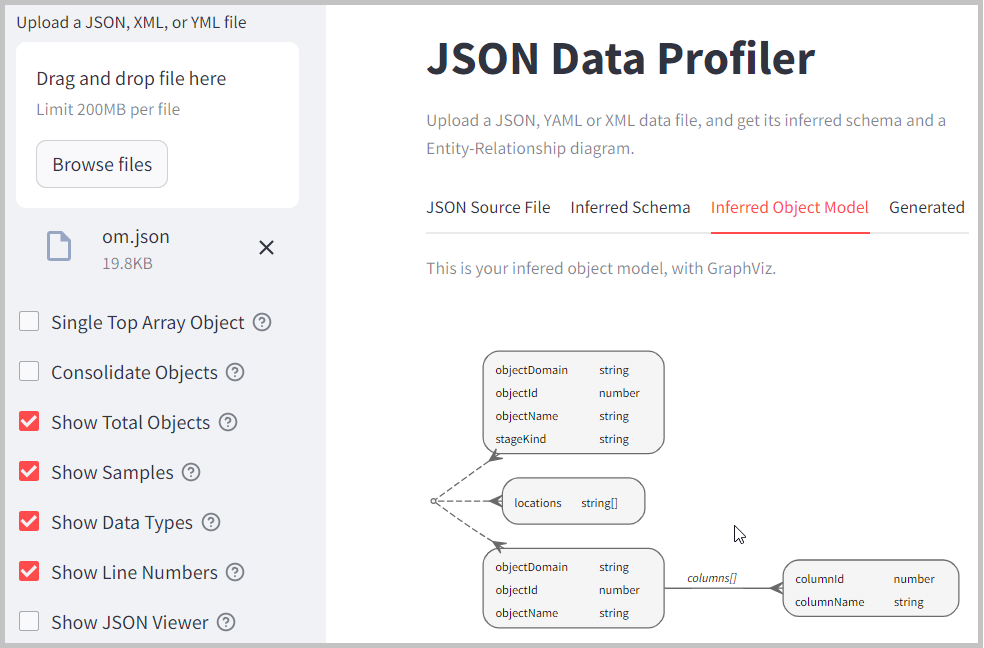
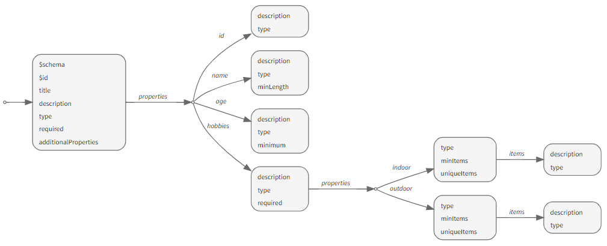
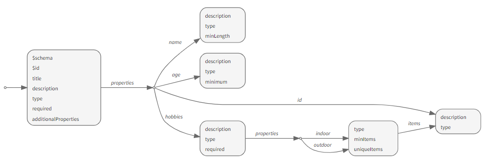

JSON Data Profiler
==================

[](https://cristiscu-json-data-profiler-app-ioixke.streamlit.app/)

Extracts metadata information from any JSON, XML or YAML data file, and generates an inferred schema, in JSON format. Then creates a visual entity-relationship diagram using GraphViz. Any XML or YAML file is first converted to JSON.

Inferred Schema Generation Options
----------------------------------

* Shows only single top object in homogenous collections, with optional properties. Use this option when you assume all array objects have the same type, with some properties not always required.
* Shows different types of objects in heterogenous collections, with no optional properties. Use this option when you may have objects of different types in your arrays, and each object type has the same manatory properties.
* In the visual object model, combines entities with similar properties and data types. Use this option to avoid duplicate shapes with a similar structure, even if they may link under different parents.

Data Profiling Features
-----------------------

* Adds a * suffix to the names of optional (i.e. not always required) properties.
* Shows JSON data type for each basic property (numeric, string, bool, null).
* Shows how many times each property appeared in the data file. This is how many objects used that property.
* Shows how many distinct values each basic property had.
* Shows the first few values (by defaut three) for each basic property.
* Truncates large text values.
* Shows objects with one single property, and arrays with primive values, on one single line.

(1) Assuming Homogenous Collections
-----------------------------------

For the **om.json** input data file, we can first assume that most if not all objects in an array have the same type. For instance, we do not mix customers with orders. The following output files tells us which properties do not appear in all array objects:

```
[
    {
       "*objectDomain": "string", 
       "*objectId": "number", 
       "*objectName": "string", 
       "*stageKind": "string", 
       "*locations": [ "string" ],
       "*columns": 
       [
          {
             "columnId": "number", 
             "columnName": "string"
          }
       ]
    }
]
```

(2) Adding More Profiling Data
------------------------------

On the same data structure as before, we added how many objects used a property, how many distinct values we had for each property, what are the first few values for each property:

```
[
    {
       "*objectDomain (114)": "string (2): Stage, Table", 
       "*objectId (114)": "number (11): 1, 62469, 61443, ...", 
       "*objectName (114)": "string (6): WORKSHEETS_APP.PUBLI..., DB1.PUBLIC.CUSTOMERS, DB1.PUBLIC.T1, ...", 
       "*stageKind (104)": "string (1): Internal Named", 
       "*locations (38)": [ "string (1): /" ],
       "*columns (10)": 
       [
          {
             "columnId (2)": "number (2): 63490, 62468", 
             "columnName (2)": "string (2): CITY, NAME"
          }
       ]
    }
]
```

(3) Assuming Heterogenous Collections
-------------------------------------

When you had plenty of optional properties in phase one, you may assume that the collections are not as homogenous, and you can get a better different view, in which each object type is always defined by the exact same set of mandatory properties:

```
[
   {
      "objectDomain (104)": "string (1): Stage", 
      "objectId (104)": "number (1): 1", 
      "objectName (104)": "string (1): WORKSHEETS_APP.PUBLI...", 
      "stageKind (104)": "string (1): Internal Named"
   },
   { "locations (38)": [ "string (1): /" ] },
   {
      "columns (10)": [{
         "columnId (2)": "number (2): 63490, 62468", 
         "columnName (2)": "string (2): CITY, NAME"
      }],
      "objectDomain (10)": "string (1): Table", 
      "objectId (10)": "number (10): 62469, 61443, 62467, ...", 
      "objectName (10)": "string (5): DB1.PUBLIC.CUSTOMERS, DB1.PUBLIC.T1, DB1.PUBLIC.CITIES, ..."
   }
]
```

(4) Generating a Visual Object Model
------------------------------------

While it may still be hard enough to properly understand a complex structure from JSON text, a visual ERD-like representation can help. Here is the diagram related to the last JSON code:



The main differences from a pure Entity-Relationship diagram, for a relational model:

* There is no class name, because in JSON we have anonymous objects.
* A one-to-one relationship is always unidirectional, parent-child, from a parent JSON object to an embedded child JSON object.
* A one-to-many relationship, through a JSON array, can have aggregate entity types.
* Arrays of primitive objects are represented with the type name followed by a [] suffix.
* All properties that point to other objects, or to collections or objects, have been moved as labels on the relationship links. If there are no static properties in the parent node, the entity may be represented by a dot.

(5) Consolidating Duplicate Objects
-----------------------------------

Different object types, under different parents, may have identical property names and return the same data types. This option may remove such duplicate shapes from the visual entity-relationship diagram.

Assume the following object model generated in one of the previous phases, reflecting the JSON inferred schema hierarchy:



The *indoor* and *outdoor* properties each return objects with similar properties (*type*, *minitems*, and *uniqueitems*). Which further, through *items*, return other potentially reusable objects (with *description* and *type* properties). Another similar entity with these last two properties is returned before by the *id* property.

After consolidation, all the duplicate entities will be combined into one single entity, with all related links redirected. The *indoor* and *outdoor* properties will now point to one single entity. And the three entities with *description* and *type* have been combined into one single shape:



Setup Instructions
------------------
* Clone the repository locally, and open it in VSCode or some other IDE.
* Create and activate a virtual environment.
* Install all the dependencies from the **requirements.txt** file.
* Run **`streamlit run app.py`**. Terminate the web session with CTRL+C.

